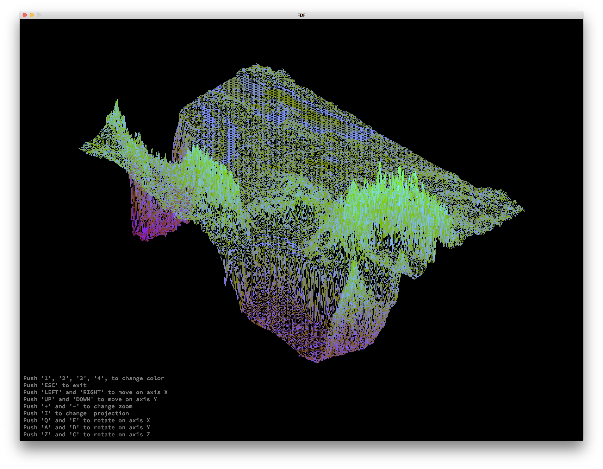
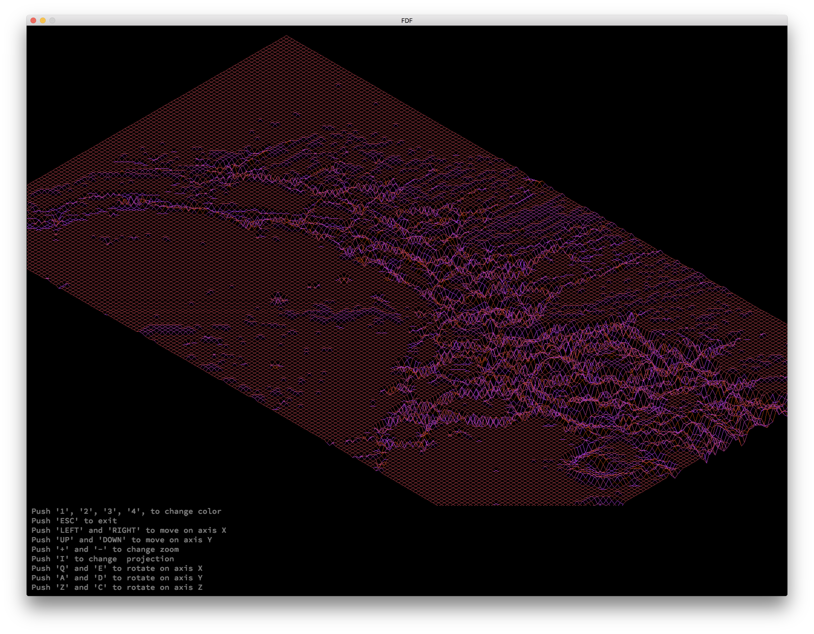

# FDF-42
The program involves basics of graphic programming with miniLibX

## About
The representation in 3D of a landscape is a critical aspect of modern mapping. This project is about creating a simplified graphic “wireframe” (“fils de fer” in french,
hence the name of the project) representation of a relief landscape linking various points (x, y, z) via segments. The coordinates of this landscape are stored in a file passed as a parameter to your program.



## Installation
1. Download/Clone this repo
```
git clone https://github.com/pankratdodo/FDF-42.git
```
2. `cd` into directrory and run `make`
```
cd FDF-42 && make && ./fdf test_maps/'any file'.fdf
```

## Main project instructions
#### General Instructions
- Project must be written in C in accordance with [the Norm](https://github.com/R4meau/minishell/blob/master/norme.en.pdf).
- Program cannot have memory leaks.
- No Segmentation fault, bus error, double free, etc.
- Cannot use global variables.
- Must use the miniLibX. Either in the version that is available on the system, or from its sources.
- Allowed to use the following functions:
  - *open, read, write, close*
  - *malloc, free*
  - *perror, strerror*
  - *exit*
  - All the functions defined in the `math` library (-lm and man 3 math)
  - All the functions defined in the `miniLibX` library.
  
#### Mandatory part
- Must have 2 type of projection but you stay free to choose the type of projection: parallel, iso, conic.
- Must be able to quit the program by pressing `esc`.
- The use of images from `minilibX` is strongly encouraged.
- Find attached a binary called fdf.



#### Bonus part
- Change color using `1`, `2`, `3`, `4`.
- Move on axis X using `LEFT` and `RIGHT`.
- Move in axis Y using `UP` and `DOWN`.
- Change zoom using `+` and `-`.
- Change projection using `I`.
- Rotate on axis X using `Q` and `E`.
- Rotate on axis Y using `A` and `D`.
- Rotate on axis Z using `Z` and `C`.
- Menu to help navigation.
